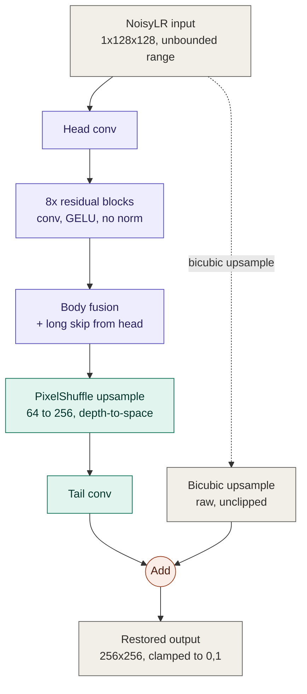

# KLA AI Image Restoration — SEMICON India Hackathon 2026

**Team Strive** — KLA Track: AI-Based Restoration of Degraded Images for Semiconductor Inspection

An end-to-end deep learning pipeline that restores degraded 128×128 grayscale semiconductor inspection images into clean 256×256 outputs, combining denoising, 2× super-resolution, and fine-detail restoration in a single lightweight model.

The repository includes training, validation, inference, evaluation metrics, inference benchmarking, dataset analysis, visualization, and submission validation. The standalone inference entry point is `evaluate.py` — this is the script intended for direct use by external benchmarking teams.

## Problem Statement

| | |
|---|---|
| Input | 128×128 grayscale `.npy` (`NoisyLR`) |
| Output | 256×256 grayscale `.npy` (restored) |
| Degradation | Speckle noise, additive Gaussian noise, and downsampling, applied in unspecified order |

Value ranges:
- `NoisyLR` is **not** restricted to `[0,1]` — observed values range approximately `-0.28` to `2.16`, preserved as real input signal and never clipped before entering the model.
- `GT` values are always in `[0,1]`.
- Final restored outputs are constrained to `[0,1]`.

The model performs joint denoising and 2× super-resolution while preserving structural detail.

## Dataset

```
train/
├── GT/          # 3,200 clean 256×256 .npy images
└── NoisyLR/     # 3,200 degraded 128×128 .npy images
```

`NoisyLR/XXXXXX.npy` ↔ `GT/XXXXXX.npy` — identical filenames define input/target pairs.

```
Test_NoisyLR/
└── NoisyLR/     # 400 test images
```

The official test set has no released ground truth.

- Arrays are `float32`
- GT range: `[0,1]`; NoisyLR approximate range: `[-0.28, 2.16]`
- 3,200 training pairs, 400 test images
- macOS artifacts (`__MACOSX/`, `._*`) are automatically ignored throughout the pipeline

The complete dataset is not stored in this repository due to its size and dataset restrictions. The pipeline accepts a dataset path via `--data_root`.

## Model Architecture

**LiteRestoreNet** — a lightweight residual encoder-decoder CNN designed specifically for restoration at 128×128 input resolution, ~0.77M parameters (default: `channels=64`, `num_blocks=8`).



Key decisions:
- **No internal downsampling** — residual blocks operate at full input resolution, preserving fine spatial detail, which matters for semiconductor inspection imagery.
- **PixelShuffle upsampling** — efficient, learned 2× upsampling that avoids the checkerboard artifacts common with transposed convolutions.
- **Global residual connection** — the network predicts a correction on top of a bicubic-upsampled input rather than reconstructing the image from scratch, letting it focus capacity on correcting degradation and recovering missing detail.
- Intentionally lightweight compared to large transformer-based restoration models (e.g. Restormer, SwinIR).

Full rationale: [docs/architecture.md](docs/architecture.md).

## Methodology

**Loss** — a composite of:
- **Charbonnier loss** — primary reconstruction term, robust to residual noise and less sensitive to outliers than L2.
- **SSIM loss** — encourages structural similarity between restored and ground-truth images.
- **Sobel gradient loss** — encourages edge preservation and reduces over-smoothing of fine structures.

**Augmentation** — horizontal flip, vertical flip, and 90° rotations only, which preserve physical structure without introducing geometric distortion.

**Data handling**:
- `NoisyLR` is never clipped before entering the model.
- Output is constrained to `[0,1]` at inference/metric time only.
- Deterministic 90/10 train/validation split with a fixed random seed — no separate validation directory required.

Full methodology: [docs/methodology.md](docs/methodology.md).

## Installation

```bash
python -m venv .venv
source .venv/bin/activate
pip install -r requirements.txt
```

PyTorch-based; CUDA is used automatically when available, with CPU and Apple Silicon MPS fallback for local development.

## Dataset Configuration

Dataset paths are not hard-coded. `--data_root` should point to a directory containing:

```
train/
├── GT/
└── NoisyLR/
```

## Training

```bash
python train.py --config configs/config.yaml \
    --data_root /path/to/FULL_KLA_DATASET/train
```

- `best.pth` — checkpoint with the highest validation PSNR
- `last.pth` — most recent checkpoint, for resuming
- Checkpoints are stored in `artifacts/checkpoints/`

Resume training:
```bash
python train.py --config configs/config.yaml \
    --data_root /path/to/FULL_KLA_DATASET/train \
    --resume artifacts/checkpoints/last.pth
```

Smoke test (verifies pipeline functionality only — not representative of final model quality):
```bash
python train.py --config configs/config.yaml \
    --data_root /path/to/FULL_KLA_DATASET/train \
    --epochs 2 --limit_samples 32 --device cpu
```

## Inference / Evaluation — Official Entry Point

**`evaluate.py` is the official standalone inference entry point for this submission**, intended for direct use by external benchmarking teams. It:

- Accepts an input directory and an output directory
- Loads the trained model (`models/final_model.pth`) automatically
- Processes all `.npy` input images and generates 256×256 outputs, preserving filenames
- Creates the output directory if necessary
- Requires no source-code modification, no training, no notebook, and no internet connection at runtime
- Uses CUDA automatically when available, with `torch.inference_mode()`

```bash
python evaluate.py \
    --input_dir /path/to/test_images \
    --output_dir /path/to/restored_outputs
```

Official test set:
```bash
python evaluate.py \
    --input_dir /path/to/Test_NoisyLR/NoisyLR \
    --output_dir outputs/restored_test
```

## Trained Model Weights

`models/final_model.pth` contains the trained model weights used by the inference pipeline. Files exceeding GitHub's standard size limits should be tracked with Git LFS.

## Evaluation Metrics

```bash
python evaluate_metrics.py \
    --pred_dir outputs/restored_test \
    --gt_dir /path/to/ground_truth \
    --lpips
```

Computes PSNR, SSIM, and optional LPIPS between predictions and ground truth. Since images are grayscale, the single channel is replicated to three channels before computing LPIPS. Official test-set metrics cannot be computed locally, since the official ground truth is not released.

## Inference Benchmark

```bash
python scripts/benchmark_inference.py \
    --input_dir /path/to/Test_NoisyLR/NoisyLR \
    --weights models/final_model.pth
```

Reports model load time, mean/median/p95 inference time, throughput, parameter count, and model size.

## Restored Test Outputs

`outputs/restored_test/` contains the restored `.npy` outputs generated by the trained model for the official 400-image test set. Ground-truth quality metrics for these outputs are not available, since the official test ground truth is not released.

## Results

**Best validation PSNR: 28.37 dB** — measured on the held-out 10% validation split, fixed random seed, reached after 200 training epochs.

**Validation SSIM (final epochs): 0.766–0.768**

These are validation-set results, not official test-set results. The official 400-image test set has no released ground truth, so official test PSNR/SSIM/LPIPS cannot be calculated locally.

## Repository Structure

```
KLA-AI-Image-Restoration/
├── README.md
├── requirements.txt
├── LICENSE
├── train.py                    # training entry point
├── evaluate.py                 # official inference entry point
├── evaluate_metrics.py         # PSNR / SSIM / LPIPS against ground truth
├── configs/
│   └── config.yaml             # all hyperparameters and paths
├── models/
│   └── final_model.pth         # trained checkpoint used for inference
├── outputs/
│   ├── metrics.csv
│   ├── metrics.json
│   ├── restoration_comparison.png
│   └── restored_test/          # model outputs for the 400 test images
├── src/
│   ├── dataset.py               # pairing, splitting, augmentation
│   ├── model.py                 # LiteRestoreNet
│   ├── losses.py                # Charbonnier + SSIM + gradient loss
│   ├── metrics.py                # PSNR / SSIM / LPIPS implementations
│   ├── inference.py             # shared inference helpers
│   └── utils.py                  # seeding, checkpointing, logging
├── scripts/
│   ├── analyze_dataset.py       # dataset statistics and validation
│   ├── benchmark_inference.py    # inference speed/size benchmark
│   ├── validate_submission.py    # repository completeness checklist
│   └── visualize_results.py     # degraded / restored / GT comparison grids
├── docs/
│   ├── architecture.md
│   ├── methodology.md
│   └── video_demo_script.md
└── artifacts/
    ├── checkpoints/
    ├── logs/
    └── metrics/
```

## Reproducibility

- Fixed random seeds for weight initialization, data shuffling, and the train/validation split.
- Deterministic, seed-controlled train/validation split.
- All hyperparameters live in `configs/config.yaml`; every checkpoint stores the exact configuration used to produce it.
- Training and inference are standalone Python scripts with no notebook dependency.

## Submission Compliance

- [x] README.md
- [x] Standalone evaluation/inference script (`evaluate.py`)
- [x] Training script (`train.py`)
- [x] Trained model weights (`models/final_model.pth`)
- [x] Restored test outputs (`outputs/restored_test/`)
- [x] requirements.txt

`evaluate.py` is the critical file in this repository — it is intended to be used as-is for measuring restoration quality and inference time.

## Team

**Team Strive**
KLA Track — AI-Based Restoration of Degraded Images for Semiconductor Inspection

## References

1. T. Kumar, R. Brennan, A. Mileo and M. Bendechache, "Image Data Augmentation Approaches: A Comprehensive Survey and Future Directions," IEEE Access, vol. 12, 2024.
2. Zhai, L., Wang, Y., Cui, S., Zhou, Y. "A comprehensive review of deep learning-based real-world image restoration." IEEE Access 11 (2023).
3. Terven, J., Cordova-Esparza, D.M., Romero-González, J.A. et al. "A comprehensive survey of loss functions and metrics in deep learning." Artificial Intelligence Review 58, 195 (2025).
4. V. Monga et al., "Algorithm Unrolling: Interpretable, Efficient Deep Learning for Signal and Image Processing," IEEE Signal Processing Magazine, vol. 38, no. 2, 2021.
